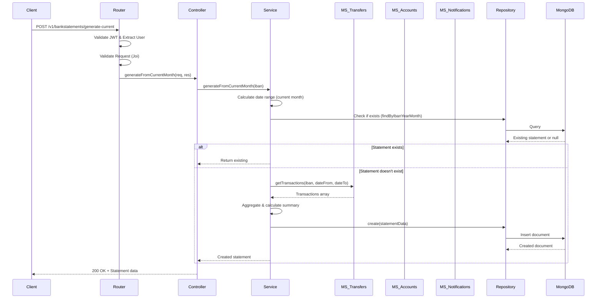

# Documentacion 

| **Autora**                 | **Microservicio Implementado**       |
|:---------------------------|:-------------------------------------|
| **Edith Cáceres Tafur**    | Microservicio Bank Statements (Node.js) |
---

## 1. Nivel de Acabado

**Acabado:** **8**, se incluyen 6 características del microservicio avanzado implementadas. 

El microservicio **Bank Statements** se presenta totalmente operativo e integrado en la arquitectura global de **BancUS**:

* **Microservicio Bank Statements (Node.js/Express):** Funcionalidad completa CRUD, generación automática mensual mediante cron job (día 1 de cada mes), generación manual del mes actual, consulta histórica por IBAN y período, integración con microservicios de transacciones y disponible para uso de Antifraude y Notificaciones, con un formato robusto en caso de Auditoria, visualizada en el interfaz común del proyecto.

### Características implementadas

* **MICROSERVICIO BÁSICO QUE GESTIONE UN RECURSO** completo: La entrega incluye el microservicio Bank Statements operativo en la arquitectura de microservicios, integrado con el API Gateway, persistencia NoSQL (MongoDB), autenticación centralizada (JWT), documentación de API (Swagger/OpenAPI), dockerización, y un frontend común con rutas y navegación para operar el recurso de estados de cuenta desde la interfaz.
  * **El backend debe ser una API REST tal como se ha visto en clase implementando al menos los métodos GET, POST, PUT y DELETE y devolviendo un conjunto de códigos de estado adecuado.** --> [microservice-bank-statements/src/bank-statements/router.js](https://github.com/BancUS-FISProject/microservice-bank-statements/blob/master/src/bank-statements/router.js) (incluye Swagger también).
    * GET `/v1/bankstatements/by-iban/:iban` - Lista meses disponibles (200, 403, 404)
    * GET `/v1/bankstatements/by-iban?iban&month` - Obtiene estado específico (200, 400, 403, 404)
    * GET `/v1/bankstatements/:id` - Obtiene por ID (200, 400, 404)
    * POST `/v1/bankstatements/generate` - Genera estado manual (201, 400, 500)
    * POST `/v1/bankstatements/generate-current` - Genera del mes actual (201, 200, 400, 404, 502)
    * PUT `/v1/bankstatements/:id` - Actualiza estado (200, 400, 404)
    * DELETE `/v1/bankstatements/:id` - Elimina estado (200, 404)
  * **Debe haber pruebas de componente implementadas en Javascript para el código del backend utilizando Jest o similar. Como norma general debe haber tests para todas las funciones del API no triviales de la aplicación. Probando tanto escenarios positivos como negativos. Las pruebas deben ser tanto in-process como out-of-process**. --> Uso de Jest + Supertest. **19 tests totales**: [Tests internos (8 pruebas)](https://github.com/BancUS-FISProject/microservice-bank-statements/blob/master/test/internal.test.js) (in-process), [Tests externos (11 pruebas)](https://github.com/BancUS-FISProject/microservice-bank-statements/blob/master/test/external.test.js) (out-of-process).

* **MICROSERVICIO AVANZADO QUE GESTIONE UN RECURSO (6):**
  * **Implementar un frontend con rutas y navegación.** --> [Frontend común - Página Statements](https://github.com/BancUS-FISProject/BancUS-frontend/blob/master/src/pages/StatementsPage.jsx) integrada en la navegación principal con visualización de meses disponibles, detalle de transacciones, generación manual ("Simular") y eliminación de estados.
  * **Despliegue de microservicios en la nube utilizando contenedores Docker con al menos 2 instancias del microservicio balanceadas.** --> Deployment en servidor remoto (68.221.252.242) con Docker, imagen publicada en [Docker Hub](https://hub.docker.com/r/edithct/microservice-bank-statements), orquestación con Docker Compose.
  * **Implementar una base de datos para cada microservicio.** --> MongoDB dedicado con esquema BankStatement (Mongoose ODM), índices únicos compuestos (iban + year + month) para prevenir duplicados, persistencia de transacciones y resúmenes calculados.
  * **Implementar validaciones robustas en el backend.** --> Validación con **Joi** en todos los endpoints: IBAN español (ES + 22 dígitos), formato de mes (YYYY-MM), ObjectId MongoDB (24 hex), estructura de transacciones, rangos de fechas. Middleware `validate.js` intercepta errores y devuelve respuestas consistentes (400 Bad Request).
  * **Implementar la integración con al menos 2 microservicios.** --> Integración activa con:
    1. **Microservicio Transfers** (`/v1/transactions`) - Obtención de transacciones por IBAN y rango de fechas para generación de estados.
    2. **Microservicio Notifications** (`/v1/notifications`) - Envío de notificaciones automáticas al generar nuevos estados de cuenta.
    3. **Microservicio Accounts** (uso indirecto) - Validación de existencia de cuentas y obtención de información de usuario.
  * **Implementar documentación de API (OpenAPI/Swagger).** --> Especificación completa en [openapi/bank-statements.yaml](https://github.com/BancUS-FISProject/microservice-bank-statements/blob/master/openapi/bank-statements.yaml), Swagger UI accesible en `/api-docs`, generación dinámica con `swagger-jsdoc` y anotaciones JSDoc en rutas.
  * **Implementar CI/CD con GitHub Actions.** --> Pipelines automatizados: [Docker Build & Push](https://github.com/BancUS-FISProject/microservice-bank-statements/actions/workflows/docker-build-push.yml) (build de imagen multi-stage y publicación en Docker Hub en cada push a main), [Run Tests](https://github.com/BancUS-FISProject/microservice-bank-statements/actions/workflows/test.yml) (ejecución de 19 tests en cada push/PR).

### Análisis justificativo de la suscripción óptima de las APIs del proyecto

En el caso del microservicio **Bank Statements**, no se requiere consumo directo de APIs externas de pago. Las dependencias se limitan a:

1. **Microservicio Transfers** (interno) - Sin coste, infraestructura propia.
2. **Microservicio Notifications** (interno, que a su vez usa SendGrid) - El coste de SendGrid ya está justificado en la documentación del equipo (Free Trial de 60 días con 100 correos/día, suficiente para notificaciones de estados generados).

Por tanto, para **Bank Statements** la suscripción óptima es **cero costes adicionales**, ya que opera exclusivamente sobre infraestructura interna del proyecto BancUS sin consumir APIs de terceros de forma directa.

## 2. Descripción del Microservicio

El **Microservicio Bank Statements** es responsable de la **generación, almacenamiento y consulta de estados de cuenta bancarios mensuales** para el sistema **BancUS**. 

Proporciona funcionalidades clave para:
* **Generación automática programada** de estados de cuenta el primer día de cada mes (cron job).
* **Generación manual bajo demanda** del mes actual consumiendo transacciones del microservicio Transfers.
* **Consulta histórica** de estados de cuenta por IBAN y período (mes/año).
* **Operaciones CRUD completas** sobre estados de cuenta.
* **Integración con microservicios** de transacciones, cuentas y notificaciones.
* **Visualización gráfica** en frontend para que los clientes revisen sus balances mensuales.

## 3. Descomposición y Arquitectura

El microservicio se integra en la arquitectura global de **BancUS** (proyecto grupal), componiendo junto con:

1. **API Gateway:** Punto único de entrada. Protege la red interna, distribuye peticiones, implementa throttling y autenticación centralizada.
2. **Microservicio Accounts (Python/Quart):** Persistencia y lógica de cuentas, gestión de estados (bloqueo/desbloqueo).
3. **Microservicio Currencies (Java/Spring Boot):** Conversión de divisas con integración a APIs externas (RapidAPI).
4. **Microservicio Cards (Node.js/Express):** Gestión de tarjetas (CRUD), estados (active/frozen).
5. **Microservicio User Auth (NestJS/Express):** Alta/edición de usuarios, login con CAPTCHA, emisión y validación de JWT.
6. **Microservicio Anti-Fraud (NestJS/Express):** Detección de fraude, gestión de alertas, bloqueo proactivo de cuentas.
7. **Microservicio Transfers (Node.js/Express):** Gestión de transacciones bancarias, transferencias entre cuentas.
8. **Microservicio Scheduled Payments (Python/Quart):** Transferencias programadas con sincronización NTP y rate limiting.
9. **Microservicio Notifications (Python/Quart):** Notificaciones por email utilizando SendGrid.
10. **Microservicio Bank Statements (Node.js/Express):** **(Este microservicio)** Gestión completa de estados de cuenta bancarios.
11. **Frontend común (React/Vite):** Interfaz unificada con rutas y navegación para todos los microservicios.

### Arquitectura Interna del Microservicio Bank Statements

```
┌─────────────────────────────────────────────────────────┐
│                     HTTP Layer                           │
│  ┌────────────────────────────────────────────────────┐ │
│  │  Router (Express) - Rutas y Middlewares            │ │
│  │  • Auth Middleware (JWT extraction)                │ │
│  │  • Validation Middleware (Joi)                     │ │
│  └────────────────────────────────────────────────────┘ │
└───────────────────────┬─────────────────────────────────┘
                        │
┌───────────────────────▼─────────────────────────────────┐
│                  Controller Layer                        │
│  ┌────────────────────────────────────────────────────┐ │
│  │  bankStatementsController.js                       │ │
│  │  • Request/Response handling                       │ │
│  │  • HTTP Status codes                               │ │
│  │  • Error formatting                                │ │
│  └────────────────────────────────────────────────────┘ │
└───────────────────────┬─────────────────────────────────┘
                        │
┌───────────────────────▼─────────────────────────────────┐
│                   Service Layer                          │
│  ┌────────────────────────────────────────────────────┐ │
│  │  bankStatementsService.js                          │ │
│  │  • Business Logic                                  │ │
│  │  • Transaction aggregation                         │ │
│  │  • Communication with other microservicios         │ │
│  │  • Summary calculations                            │ │
│  └────────────────────────────────────────────────────┘ │
└───────────────────────┬─────────────────────────────────┘
                        │
        ┌───────────────┼───────────────┐
        │               │               │
┌───────▼──────┐ ┌─────▼──────┐ ┌─────▼──────────┐
│  Repository  │ │   MS Comm  │ │   Scheduler    │
│    Layer     │ │  Strategies│ │   (Cron Job)   │
│              │ │            │ │                │
│ MongoDB CRUD │ │ HTTP/Mock  │ │ node-cron      │
└──────────────┘ └────────────┘ └────────────────┘
```
### Flujo de Generación de Estado de Cuenta


## Tecnologías Utilizadas

### Core

| Tecnología | Versión | Propósito |
|-----------|---------|-----------|
| **Node.js** | 24+ | Runtime JavaScript |
| **Express** | 5.x | Framework web minimalista |
| **MongoDB** | 7+ | Base de datos NoSQL |
| **Mongoose** | 8.x | ODM para MongoDB |

### Librerías Principales

| Librería | Uso |
|---------|-----|
| **jsonwebtoken** | Autenticación y extracción de datos de usuario |
| **Joi** | Validación de esquemas y datos de entrada |
| **node-cron** | Scheduler para generación automatizada mensual |
| **axios** | Cliente HTTP para comunicación entre microservicios |
| **dotenv** | Gestión de variables de entorno |
| **cors** | Manejo de CORS para peticiones cross-origin |

### Testing

| Herramienta | Uso |
|------------|-----|
| **Jest** | Framework de testing |
| **Supertest** | Testing de APIs HTTP |
| **MongoDB Memory Server** | Base de datos en memoria para tests |

### DevOps

| Herramienta | Uso |
|------------|-----|
| **Docker** | Containerización |
| **Docker Compose** | Orquestación local |
| **GitHub Actions** | CI/CD pipelines |
| **Swagger UI** | Documentación interactiva de API |

---

## Modelo de Datos

### Bank Statement Schema

```javascript
{
  _id: ObjectId,                    // ID de MongoDB (autogenerado)
  accountId: String,                // ID de la cuenta (opcional)
  iban: String,                     // IBAN español (ES + 22 dígitos)
  year: Number,                     // Año del estado (ej: 2026)
  month: Number,                    // Mes del estado (1-12)
  transactions: [                   // Array de transacciones
    {
      id: String,                   // ID de la transacción
      date: Date,                   // Fecha de la transacción
      description: String,          // Descripción
      amount: Number,               // Monto (positivo=ingreso, negativo=egreso)
      balance: Number               // Saldo resultante
    }
  ],
  summary: {                        // Resumen calculado
    totalIncome: Number,            // Total de ingresos
    totalExpense: Number,           // Total de egresos
    finalBalance: Number            // Saldo final
  },
  generatedAt: Date,                // Timestamp de generación
  source: String                    // Origen: 'auto', 'manual', 'cron'
}
```

## API Endpoints

**Base URL**: `/v1/bankstatements`
Definidas en el **Código del router**:(https://github.com/BancUS-FISProject/microservice-bank-statements/blob/master/src/bank-statements/router.js)

### Resumen de Endpoints

| Método | Endpoint | Descripción |
|--------|----------|-------------|
| GET | `/health` | Health check del servicio |
| GET | `/by-iban/:iban` | Lista meses disponibles |
| GET | `/by-iban?iban&month` | Obtiene estado de cuenta específico |
| GET | `/:id` | Obtiene estado de cuenta por ID |
| POST | `/generate` | Genera estado manual |
| POST | `/generate-current` | Genera estado del mes actual |
| PUT | `/:id` | Actualiza estado de cuenta |
| DELETE | `/:id` | Elimina estado de cuenta |


## 4. Customer Agreement (SLA e Interfaz)

### 4.1. Customer Agreement (SLA e Interfaz)

**Formato de respuestas**
* Respuestas exitosas y de error en JSON.
* Errores consistentes y trazables (código, mensaje y, cuando proceda, detalle).

**Semántica HTTP**
* `200` para lecturas y actualizaciones con contenido.
* `201` para creación.
* `204` para operaciones sin contenido.
* `400` para validación y datos mal formados.
* `401` para no autenticado.
* `403` para autenticado sin permisos o por restricción de plan.
* `404` para recurso inexistente.
* `500` para error interno del servidor.
* `502` para dependencia no disponible cuando una operación requiere un servicio aguas abajo (ej. Transfers no responde).

**Disponibilidad y degradación**
* Ante caída de dependencias, se devuelve error controlado con `502` y no se bloquea el servicio.
* Se utilizan timeouts configurables para evitar fallo en cascada.
* El health check (`/health`) responde siempre con `200` si el servicio está operativo, independientemente del estado de dependencias externas.

**Aplicación automática de límites**
- Las políticas de plan se aplican en backend (validación en service layer).
- El frontend deshabilita acciones no permitidas e informa del motivo (límite alcanzado, funcionalidad no incluida, etc.).
- Los estados de cuenta más antiguos que el límite del plan se ocultan automáticamente en las consultas.

> **Acuerdo de Nivel de Servicio (SLA):**
> * **Disponibilidad:** El sistema está diseñado para responder con códigos 502 si un servicio dependiente cae (Transfers, Notifications), sin bloquear el hilo principal.
> * **Formato:** Todas las respuestas exitosas y de error siguen el estándar JSON.
> * **Errores:** Se implementan respuestas HTTP semánticas (400 Bad Request para validación, 404 Not Found para recursos inexistentes, 403 Forbidden para restricciones de plan).

**Políticas de Consumo:**
* Se requiere autenticación JWT previa en el Gateway y validación en el microservicio.
* Las operaciones de generación manual respetan límites de frecuencia según el plan.
* Validación estricta de tipos de datos en entrada (Strong Typing con Joi).

## 5. Descripción del API REST

### Microservicio Bank Statements (Node.js / Express)

Desarrollado con `Express.js` y persistencia en MongoDB, uso de Mongoose como ODM y documentación automática mediante **Swagger / OpenAPI**.

**Prefijo:** `/v1/bankstatements`

| Método   | Endpoint                       | Descripción                                                                      | Códigos de Respuesta      |
|:---------|:-------------------------------|:---------------------------------------------------------------------------------|:--------------------------|
| `GET`    | `/health`                      | Health check del servicio                                                        | `200`, `500`              |
| `GET`    | `/by-iban/:iban`               | Lista todos los meses disponibles para un IBAN                                   | `200`, `400`, `403`, `404`|
| `GET`    | `/by-iban?iban=...&month=...`  | Obtiene estado de cuenta específico por IBAN y mes (YYYY-MM)                     | `200`, `400`, `403`, `404`|
| `GET`    | `/:id`                         | Obtiene estado de cuenta por ID de MongoDB                                       | `200`, `400`, `404`       |
| `POST`   | `/generate`                    | Generación manual de estados de cuenta con transacciones proporcionadas          | `201`, `400`, `500`       |
| `POST`   | `/generate-current`            | Genera estado de cuenta del mes actual consumiendo transacciones externas        | `201`, `200`, `400`, `404`, `502`|
| `PUT`    | `/:id`                         | Actualiza estado de cuenta por ID                                                | `200`, `400`, `404`       |
| `DELETE` | `/:id`                         | Elimina estado de cuenta por ID                                                  | `200`, `400`, `404`       |

## 6. Justificación de Requisitos y Evidencias

A continuación se detalla cómo se han implementado los patrones de arquitectura y requisitos técnicos exigidos, detallando la ubicación en el código fuente.

### 6.1. Automatización con Cron Job (Patrón Scheduler)

Para garantizar la generación automática de estados de cuenta mensuales sin intervención manual, se ha implementado un scheduler robusto.

* **Implementación (Bank Statements):** Se ha aplicado **node-cron** con expresión `'5 0 1 * *'` que ejecuta el job el día 1 de cada mes a las 00:05. El scheduler obtiene todos los IBANs activos de la base de datos y genera el estado del mes anterior para cada cuenta.
* **Validación de Ejecución Única:** Se implementa un flag de control para evitar ejecuciones concurrentes del mismo job.
* **Recuperación de Errores:** Si la generación falla para un IBAN, el proceso continúa con los siguientes y registra el error para análisis posterior.
* **Evidencia en código:** [Ver implementación del Cron Job](https://github.com/BancUS-FISProject/microservice-bank-statements/blob/master/src/lib/scheduler/bankStatementsCron.js)

### 6.2. Estrategia de Comunicación entre Microservicios (Patrón Strategy)

Se ha implementado el **patrón Strategy** para permitir diferentes modos de comunicación con microservicios externos según el entorno de ejecución.

* **Estrategia HTTP (Producción):** Usa Axios para realizar peticiones reales a los microservicios Transfers y Notifications. Incluye manejo de timeouts y retry logic.
* **Estrategia Mock (Desarrollo/Testing):** Devuelve datos simulados sin realizar peticiones externas, permitiendo ejecutar tests de forma aislada y reproducible.
* **Configuración Dinámica:** La estrategia se selecciona mediante la variable de entorno `MS_STRATEGY` (`http` o `mock`), permitiendo cambiar el comportamiento sin modificar código.
* **Evidencia en código:** [Ver implementación de estrategias](https://github.com/BancUS-FISProject/microservice-bank-statements/blob/master/src/lib/ms/index.js), [Estrategia HTTP](https://github.com/BancUS-FISProject/microservice-bank-statements/blob/master/src/lib/ms/strategies/http.js), [Estrategia Mock](https://github.com/BancUS-FISProject/microservice-bank-statements/blob/master/src/lib/ms/strategies/mock.js)

### 6.3. Validaciones Robustas con Joi (Strong Typing)

Para garantizar la integridad de los datos y prevenir errores en runtime, se implementa validación exhaustiva en todos los endpoints.

* **Validación de IBAN:** Patrón regex `/^ES[0-9]{22}$/` que asegura formato español correcto (ES + 22 dígitos).
* **Validación de Formato de Fecha:** Mes en formato `YYYY-MM` con regex `/^\d{4}-(0[1-9]|1[0-2])$/`.
* **Validación de ObjectId:** MongoDB ObjectId válido (24 caracteres hexadecimales).
* **Validación de Estructura de Transacciones:** Schemas Joi que validan campos requeridos, tipos de datos y rangos válidos.
* **Middleware Centralizado:** El middleware `validate.js` intercepta errores de validación y devuelve respuestas consistentes en formato JSON con códigos 400 y detalles del error.
* **Evidencia en código:** [Ver validators/bankStatementsValidators.js](https://github.com/BancUS-FISProject/microservice-bank-statements/blob/master/src/validators/bankStatementsValidators.js), [Ver middleware/validate.js](https://github.com/BancUS-FISProject/microservice-bank-statements/blob/master/src/middleware/validate.js)

### 6.4. Observabilidad y Monitorización (Health Checks & Logs)

Para facilitar el despliegue en orquestadores como Kubernetes y la depuración, se han estandarizado los mecanismos de salud y trazas.

* **Health Checks (Kubernetes Ready):**
  * **Bank Statements:** Endpoint específico `/health` diseñado para los *liveness probes* de Kubernetes. Responde con status `UP` y marcador `ROUTER_HEALTH_OK`.
  * Devuelve `200 OK` si el servicio está operativo, independientemente del estado de dependencias externas.
* **Sistema de Logs Estructurado:** Se implementa logging con timestamps y contexto (`[REQ]`, `[service]`, `[repo]`, `[controller]`) que permite rastrear el flujo completo de las peticiones.
* **Filtrado de Logs de Health Checks:** Los logs del endpoint `/health` se filtran automáticamente para evitar spam en consola (health checks cada 30 segundos).
* **Evidencia en código:** [Ver endpoint de Health](https://github.com/BancUS-FISProject/microservice-bank-statements/blob/master/src/bank-statements/router.js#L10), [Ver filtrado de logs](https://github.com/BancUS-FISProject/microservice-bank-statements/blob/master/src/server.js#L35-L40)

### 6.5. Documentación Dinámica (OpenAPI/Swagger)

La documentación de la API se mantiene siempre sincronizada con el código gracias a la generación automática.

* En el microservicio de Bank Statements se utiliza `swagger-jsdoc` para generar dinámicamente el documento OpenAPI 3.0 (`swaggerSpec`) en tiempo de arranque del servidor.
* La fuente de verdad de la documentación son las anotaciones JSDoc incluidas en el propio fichero de rutas (`./routes/bankStatements.js`), indicado explícitamente en `swaggerOptions.apis`.
* Cualquier cambio en los endpoints o en sus contratos queda incorporado automáticamente en la especificación generada.
* `swagger-ui-express` publica una interfaz Swagger UI montada en la ruta `/api-docs`, sirviendo el `swaggerSpec` generado.
* **Evidencia en código:** [Ver anotaciones Swagger en router.js](https://github.com/BancUS-FISProject/microservice-bank-statements/blob/master/src/bank-statements/router.js), [Ver configuración Swagger](https://github.com/BancUS-FISProject/microservice-bank-statements/blob/master/app.js#L15-L30)

### 6.6. Testing Exhaustivo (Jest + Supertest)

Se implementa una estrategia de testing completa que cubre tanto tests unitarios/integración (in-process) como tests end-to-end (out-of-process).

* **19 Tests Totales:**
  * **8 Tests Internos (in-process):** Tests de integración que importan la app Express directamente y usan Supertest para simular peticiones HTTP sin levantar servidor. Más rápidos y aislados.
  * **11 Tests Externos (out-of-process):** Tests que requieren un servidor real en ejecución (http://localhost:3000), validando el comportamiento completo del servicio en condiciones reales.
* **Cobertura de Casos Positivos y Negativos:** Validación de creación exitosa, consultas correctas, actualizaciones, eliminaciones, y también casos de error (IBAN inválido, ID no válido, recursos no encontrados, permisos insuficientes).
* **Uso de MongoDB Memory Server:** Para tests internos se usa una instancia de MongoDB en memoria que permite aislar completamente los tests y ejecutarlos sin dependencias externas.
* **Evidencia en código:** [Ver tests internos](https://github.com/BancUS-FISProject/microservice-bank-statements/blob/master/test/internal.test.js), [Ver tests externos](https://github.com/BancUS-FISProject/microservice-bank-statements/blob/master/test/external.test.js)

## 7. Cumplimiento de metodología The Twelve-Factor App

A continuación se detalla cómo el microservicio Bank Statements cumple con los doce factores estándar para aplicaciones nativas de nube:

### 1. Codebase (Código Base)
* **Principio:** Un repositorio, múltiples despliegues.
* **Implementación:** El código del microservicio Bank Statements se gestiona en un repositorio Git independiente. Se utiliza el mismo código base para los despliegues en local (Docker Compose) y en producción (servidor remoto), inyectando las diferencias únicamente mediante variables de entorno.

### 2. Dependencies (Dependencias)
* **Principio:** Declarar y aislar dependencias explícitamente.
* **Implementación:** Todas las dependencias están declaradas en `package.json` con versiones específicas. Se usa `npm ci` en producción para instalación reproducible. Docker multi-stage build aísla dependencias de desarrollo de las de producción.

### 3. Config (Configuración)
* **Principio:** Configuración en variables de entorno.
* **Implementación:** Toda la configuración sensible (MongoDB URI, endpoints de microservicios, secretos JWT, estrategia de comunicación) se almacena en variables de entorno mediante `dotenv`. No hay configuración hardcodeada en el código. Archivo `src/config.js` centraliza acceso a variables de entorno.

### 4. Backing Services (Servicios de Respaldo)
* **Principio:** Tratar servicios externos como recursos adjuntos.
* **Implementación:** MongoDB, microservicios Transfers/Notifications/Accounts se tratan como recursos configurables mediante URLs. Se puede cambiar de un servicio local a uno remoto simplemente modificando variables de entorno sin cambiar código.

### 5. Build, Release, Run (Compilar, Liberar, Ejecutar)
* **Principio:** Separación estricta de etapas.
* **Implementación:** 
  * **Build:** GitHub Actions genera imagen Docker con tag versionado.
  * **Release:** Imagen se publica en Docker Hub con tag específico.
  * **Run:** Contenedor se ejecuta en entorno destino sin modificaciones.

### 6. Processes (Procesos)
* **Principio:** Ejecutar la aplicación como procesos sin estado.
* **Implementación:** El microservicio no almacena estado en memoria del proceso. Todo el estado se persiste en MongoDB. Múltiples instancias pueden ejecutarse en paralelo sin conflictos.

### 7. Port Binding (Vinculación de Puertos)
* **Principio:** Exportar servicios mediante vinculación de puertos.
* **Implementación:** Express se vincula al puerto configurado via `PORT` env var (default 3000). El servicio es completamente auto-contenido y no requiere servidor web externo.

### 8. Concurrency (Concurrencia)
* **Principio:** Escalar mediante el modelo de procesos.
* **Implementación:** El servicio puede escalar horizontalmente ejecutando múltiples instancias del contenedor Docker. Node.js con Express maneja concurrencia mediante event loop asíncrono.

### 9. Disposability (Desechabilidad)
* **Principio:** Maximizar robustez con inicio rápido y apagado elegante.
* **Implementación:** 
  * Inicio rápido: Servicio arranca en <5 segundos.
  * Apagado elegante: Listeners para SIGTERM cierran conexiones MongoDB y finalizan peticiones en curso antes de terminar.

### 10. Dev/Prod Parity (Paridad Desarrollo/Producción)
* **Principio:** Mantener desarrollo, staging y producción lo más similares posible.
* **Implementación:** 
  * Mismo código base y Dockerfile para todos los entornos.
  * Docker Compose replica entorno de producción localmente.
  * Estrategia mock permite testing sin dependencias reales.

### 11. Logs (Registros)
* **Principio:** Tratar logs como flujos de eventos.
* **Implementación:** Logs se emiten a stdout/stderr sin gestión de archivos. En producción, herramientas como Grafana capturan y centralizan logs. Logs estructurados con timestamps y contexto.

### 12. Admin Processes (Procesos de Administración)
* **Principio:** Ejecutar tareas administrativas como procesos únicos.
* **Implementación:** El cron job de generación mensual se ejecuta dentro del mismo contenedor pero como tarea independiente. Scripts administrativos (`test-endpoints.sh`) se ejecutan como procesos one-off separados.

---

## 🔗 Enlaces y Recursos

### Repositorio GitHub
[https://github.com/BancUS-FISProject/microservice-bank-statements](https://github.com/BancUS-FISProject/microservice-bank-statements)

### Docker Hub
[https://hub.docker.com/r/edithct/microservice-bank-statements](https://hub.docker.com/r/edithct/microservice-bank-statements)

### Frontend BancUS (Integración)
[https://github.com/BancUS-FISProject/BancUS-frontend](https://github.com/BancUS-FISProject/BancUS-frontend)

---

## Análisis de Esfuerzo

| Fecha  | Actividad Principal                                                                 | Duración |
|:-------|:-------------------------------------------------------------------------------------|:---------|
| 20 Dic | Análisis funcional y definición del dominio de estados de cuenta                    | 3 h      |
| 21 Dic | Diseño de la arquitectura del microservicio Bank Statements                          | 4 h      |
| 22 Dic | Implementación de endpoints REST principales y validadores                           | 5 h      |
| 23 Dic | Configuración de MongoDB con Mongoose y definición de schemas                        | 3 h      |
| 27 Dic | Implementación de generación automática con cron job (node-cron)                     | 4 h      |
| 28 Dic | Integración con microservicio de transacciones y estrategias http/mock               | 5 h      |
| 29 Dic | Implementación de endpoint generate-current con filtrado de transacciones            | 4 h      |
| 03 Ene | Configuración de middleware de autenticación JWT                                     | 6 h      |
| 04 Ene | Implementación de tests con Jest (internos y externos)                               | 5 h      |
| 05 Ene | Documentación OpenAPI completa con especificación YAML                               | 3 h      |
| 06 Ene | Contenerización con Docker y docker-compose                                          | 3 h      |
| 07 Ene | Configuración de GitHub Actions para CI/CD                                           | 2 h      |
| 08 Ene | Pruebas de integración con otros microservicios y modificación de visata en frontend                                      | 18 h      |
| 09 Ene | Documentación técnica completa (README, ejemplos, scripts)                           | 4 h      |
|        | **Total**                                                                            | **69 h** |

---

## 👥 Autora

| Autora | Rol | Contacto |
|-------|-----|----------|
| **Edith Cáceres Tafur** | Desarrolladora | [GitHub](https://github.com/edithct) |

### Proyecto

**BancUS - FIS Project**
- Organización: [BancUS-FISProject](https://github.com/BancUS-FISProject)
- Universidad: Universidad de Sevilla
- Asignatura: Fundamentos de Ingeniería del Software
- Curso: 2025-2026

---

## Uso de Inteligencia Artificial

Durante el desarrollo de este microservicio se utilizó **GitHub Copilot** (Claude Sonnet 4.5) como herramienta de asistencia para la resolución de conflictos técnicos (depuración de errores de comunicación entre microservicios, corrección de orden de rutas en Express, configuración de nginx con SSL/TLS, y problemas CORS), mejora en la implementación de validaciones robustas con Joi (IBAN, formatos de fecha, ObjectId MongoDB, middleware de validación centralizado), me ayudó en la aplicación de mejores prácticas de arquitectura (patrón Strategy, estructura en capas, configuración de tests in-process/out-of-process). La IA aceleró el proceso de desarrollo permitiendo identificación rápida de errores y documentación profesional del proyecto. Todo el código, arquitectura y decisiones de diseño fueron validadas, comprendidas e implementadas por la autora del proyecto.

---

## Licencia

Este proyecto es parte de un proyecto académico para la asignatura de Fundamentos de Ingeniería del Software.

---

<div align="center">

**Microservicio Bank Statements - BancUS Project**

Universidad de Sevilla | Fundamentos de Ingeniería del Software | 2025-2026

</div>
